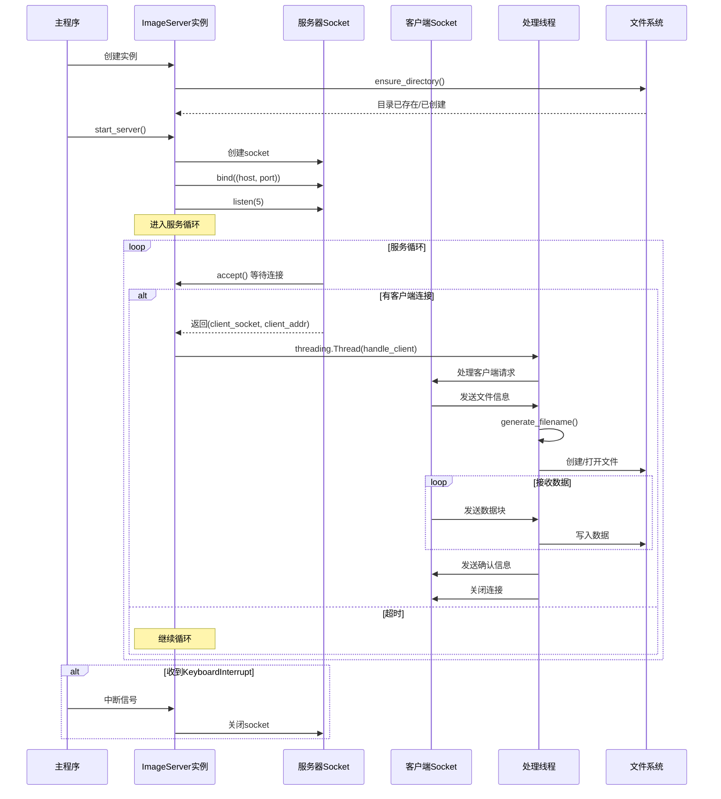
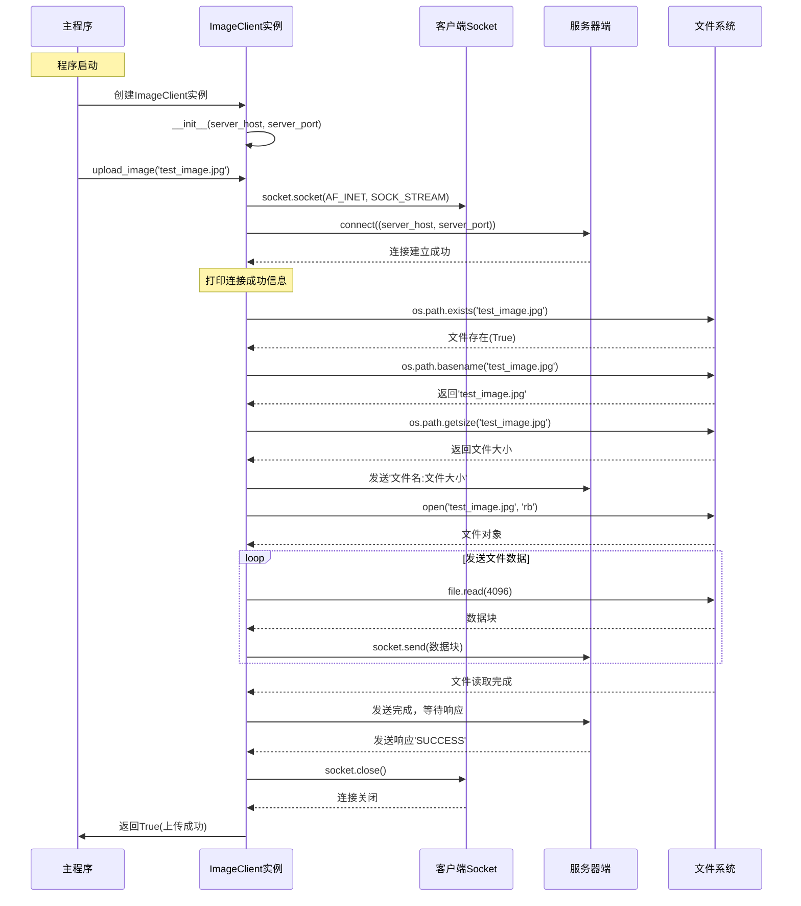

## 1. 题目要求


## 2. 设计方案的简单描述

#### 2.1 客户端程序读取硬盘中存储的图像文件并发送、服务器端接收并存储

##### server.py

main()
 └── ImageServer.__init__()
     └── ensure_directory()
 └── ImageServer.start_server()
     ├── socket.socket()
     ├── socket.setsockopt()
     ├── socket.bind()
     ├── socket.listen()
     ├── socket.settimeout()
     └── socket.accept() [循环调用]
         └── threading.Thread()
             └── handle_client()
                 ├── socket.recv() [接收文件信息]
                 ├── generate_filename()
                 ├── os.path.join()
                 ├── open() [以二进制写入模式]
                 ├── socket.recv() [循环接收文件数据]
                 ├── file.write() [循环写入数据]
                 └── socket.send() [发送确认信息]



##### client.py

main()
 └── ImageClient.__init__()
 └── ImageClient.upload_image('test_image.jpg')
     ├── ImageClient.connect_to_server()
     │   ├── socket.socket()
     │   └── socket.connect()
     └── ImageClient.send_image_file('test_image.jpg')
         ├── os.path.exists()
         ├── os.path.basename()
         ├── os.path.getsize()
         ├── socket.send() [发送文件信息]
         ├── open() [以二进制读取模式]
         ├── file.read() [循环读取并发送]
         └── socket.recv() [接收服务器响应]



## 3. 名词概念理解

##### 3. 1 为什么需要多线程？

##### 性能需求

1. **实时性要求**：摄像头捕获需要稳定的帧率（约30FPS），而网络发送可能因网络状况有延迟。

2. 避免阻塞:如果单线程执行，网络发送的延迟会阻塞摄像头捕获，导致画面卡顿。如果摄像头处理（显示、编码）耗时，会阻塞网络发送，导致传输不流畅。


**生产者-消费者模式**

- **生产者**：`capture_frames`线程不断生产视频帧
- **消费者**：`send_frames`线程不断消费（发送）视频帧
- **缓冲区**：`frame_queue`作为中间队列，平衡生产和消费速度差异

##### 3.2


## 4. 代码的运行结果


## 5. 附加

5.1

#### 2.2 读取摄像头视频并发送；多线程实现

##### camera_client.py

main()
 └── CameraClient.__init__()
 └── CameraClient.start_streaming()
     ├── CameraClient.connect_to_server()
     │   ├── socket.socket()
     │   └── socket.connect()
     └── CameraClient.start_camera()
         └── cv2.VideoCapture(0)
         └── camera.isOpened()

​	 ├── threading.Thread() [捕获线程]
​	 │   └── CameraClient.capture_frames() [循环执行]
​	 │       ├── camera.read()
 	│       ├── cv2.imshow()
​	 │       ├── cv2.waitKey()
​	 │       └── queue_lock.acquire()/release()
 	│
 	└── threading.Thread() [发送线程]
  	   └── CameraClient.send_frames() [循环执行]
​      	   ├── queue_lock.acquire()/release()
​       	  ├── cv2.imencode()
​       	  ├── pickle.dumps()
​       	  ├── struct.pack()
​       	  └── socket.sendall()

​	 └── cv2.waitKey() [主循环]
​	 └── CameraClient.stop_streaming()
  	   ├── camera.release()
​	     ├── socket.close()
  	   └── cv2.destroyAllWindows()


##### stream_server.py

main()
 └── VideoStreamServer.__init__()
     └── ensure_directory()
         ├── os.path.exists()
         └── os.makedirs()
 └── VideoStreamServer.start_video_server()
     ├── socket.socket()
     ├── socket.setsockopt()
     ├── socket.bind()
     ├── socket.listen()
     └── socket.accept() [循环调用]
         └── threading.Thread()
             └── handle_video_client()
                 ├── struct.calcsize()
                 ├── socket.recv() [循环接收数据头]
                 ├── struct.unpack()
                 ├── socket.recv() [循环接收帧数据]
                 ├── pickle.loads()
                 ├── cv2.imdecode()
                 ├── datetime.now().strftime()
                 ├── os.path.join()
                 ├── cv2.imwrite()
                 ├── cv2.imshow()
                 └── cv2.waitKey()


#### 2.3 使用协程实现

camera-client.py


server.py

## 5. 源代码

#### 2.1

```python
#client.py
import socket
import os

class ImageClient:
    def __init__(self, server_host='127.0.0.1', server_port=8888):
        self.server_host = server_host
        self.server_port = server_port
        self.client_socket = None
    
    def connect_to_server(self):
        try:
            self.client_socket = socket.socket(socket.AF_INET, socket.SOCK_STREAM)
            self.client_socket.connect((self.server_host, self.server_port))
            print(f"  连接到服务器 {self.server_host}:{self.server_port}")
            return True
        except Exception as e:
            print(f"  连接失败: {e}")
            return False
    
    def send_image_file(self, image_path):
        if not os.path.exists(image_path):
            print(f"  文件不存在: {image_path}")
            return False
        
        try:
            # 获取文件信息
            filename = os.path.basename(image_path)
            file_size = os.path.getsize(image_path)
            
            # 发送文件信息
            file_info = f"{filename}:{file_size}"
            self.client_socket.send(file_info.encode('utf-8'))
            
            # 发送文件数据
            with open(image_path, 'rb') as f:
                sent_size = 0
                while sent_size < file_size:
                    chunk = f.read(4096)
                    if not chunk:
                        break
                    self.client_socket.send(chunk)
                    sent_size += len(chunk)
            
            # 等待服务器响应
            response = self.client_socket.recv(1024).decode('utf-8')
            if response == "SUCCESS":
                print(f"  文件发送成功: {filename}")
                return True
            else:
                print(f"  文件发送失败")
                return False
                
        except Exception as e:
            print(f"  发送过程错误: {e}")
            return False
        finally:
            self.client_socket.close()
    
    def upload_image(self, image_path):
        if self.connect_to_server():
            return self.send_image_file(image_path)
        return False

if __name__ == "__main__":
    client = ImageClient()
    # 上传测试图像
    client.upload_image('test_image.jpg')
```

```python
#server.py
import socket
import os
import threading
from datetime import datetime

class ImageServer:
    def __init__(self, host='0.0.0.0', port=8888, save_dir='received_images'):
        self.host = host
        self.port = port
        self.save_dir = save_dir
        self.server_socket = None
        self.ensure_directory()
    
    def ensure_directory(self):
        if not os.path.exists(self.save_dir):
            os.makedirs(self.save_dir)
            print(f"  创建存储目录: {self.save_dir}")
    
    def generate_filename(self, original_name):
        timestamp = datetime.now().strftime("%Y%m%d_%H%M%S")
        name, ext = os.path.splitext(original_name)
        return f"{name}_{timestamp}{ext}"
    
    def handle_client(self, client_socket, client_addr):
        print(f"  客户端连接: {client_addr}")
        
        try:
            # 接收文件信息（文件名:文件大小）
            file_info = client_socket.recv(1024).decode('utf-8')
            filename, file_size = file_info.split(':')
            file_size = int(file_size)
            print(f"  接收文件: {filename}, 大小: {file_size}字节")
            # 生成保存路径
            save_filename = self.generate_filename(filename)
            save_path = os.path.join(self.save_dir, save_filename)
            # 接收文件数据
            received_size = 0
            with open(save_path, 'wb') as f:
                while received_size < file_size:
                    chunk = client_socket.recv(4096)
                    if not chunk:
                        break
                    f.write(chunk)
                    received_size += len(chunk)
            
            # 发送确认
            client_socket.send("SUCCESS".encode('utf-8'))
            print(f"  文件保存成功: {save_path}")
        except Exception as e:
            print(f"  处理客户端错误: {e}")
            client_socket.send("ERROR".encode('utf-8'))
        finally:
            client_socket.close()
    
    def start_server(self):
        self.server_socket = socket.socket(socket.AF_INET, socket.SOCK_STREAM)
        self.server_socket.setsockopt(socket.SOL_SOCKET, socket.SO_REUSEADDR, 1)
        self.server_socket.bind((self.host, self.port))
        self.server_socket.listen(5)
        self.server_socket.settimeout(1.0)  # 设置 accept() 超时 1 秒,以便KeyboardInterrupt

        print(f" 服务器启动在 {self.host}:{self.port}")
        print(" 等待客户端连接...")
        try:
            while True:
                try:
                    client_socket, client_addr = self.server_socket.accept()
                except socket.timeout:
                    continue  # 超时后继续循环，此时可以检查 KeyboardInterrupt

                client_thread = threading.Thread(
                    target=self.handle_client, 
                    args=(client_socket, client_addr)
                )
                client_thread.daemon = True
                client_thread.start()

        except KeyboardInterrupt:
            print("\n 服务器关闭")
        finally:
            self.server_socket.close()
if __name__ == "__main__":
    server = ImageServer()
    server.start_server()
```

#### 2.2

```python
#camera_client.py
import socket
import cv2
import threading
import time
import struct
import pickle

class CameraClient:
    def __init__(self, server_host='127.0.0.1', server_port=8888):
        # 初始化服务器地址和端口
        self.server_host = server_host
        self.server_port = server_port
        # 初始化摄像头
        self.camera = None
        # 流媒体状态标志
        self.is_streaming = False
        # 缓冲区，存储待发送视频
        self.frame_queue = []
        # 线程锁
        self.queue_lock = threading.Lock()
    
    def connect_to_server(self):
        try:
            # 创建套接字并连接到服务器
            # socket.AF_INET 这个参数代表使用 IPv4 地址族。
            # socket.SOCK_STREAM 这个参数代表使用 TCP 协议。
            self.client_socket = socket.socket(socket.AF_INET, socket.SOCK_STREAM)
            self.client_socket.connect((self.server_host, self.server_port))
            print(f"  连接到视频服务器 {self.server_host}:{self.server_port}")
            return True
        # try 块中的任何一步发生了错误（例如：服务器未启动、网络不通、端口错误等），程序会立即跳转到 except 块
        except Exception as e:
            print(f"  连接失败: {e}")
            return False
    
    def start_camera(self):
        print(f"send_frames 运行在线程: {threading.get_ident()}")
        self.camera = cv2.VideoCapture(0)
        if not self.camera.isOpened():
            print("  无法打开摄像头")
            return False
        print("  摄像头启动成功")
        return True
    
    def capture_frames(self):# 捕获线程
        print(f"capture_frames 运行在线程: {threading.get_ident()}")
        while self.is_streaming:
            ret, frame = self.camera.read()
            if ret:
                # 显示帧
                cv2.imshow('Camera Stream', frame)
                # 检测按键
                key = cv2.waitKey(1) & 0xFF
                if key == ord('q'):
                    self.is_streaming = False
                    break
                
                with self.queue_lock:
                    if len(self.frame_queue) < 10:
                        self.frame_queue.append(frame)
            time.sleep(0.03)

    def send_frames(self):#发送线程
        while self.is_streaming:
            with self.queue_lock:
                if self.frame_queue:
                    frame = self.frame_queue.pop(0)
                    # 压缩并序列化帧
                    _, buffer = cv2.imencode('.jpg', frame, [cv2.IMWRITE_JPEG_QUALITY, 80])
                    data = pickle.dumps(buffer)
                    # 发送帧大小和数据
                    try:
                        message = struct.pack("Q", len(data)) + data
                        self.client_socket.sendall(message)
                    except:
                        break
            time.sleep(0.01)
    
    def start_streaming(self):
        if not self.connect_to_server() or not self.start_camera():
            return False
        
        self.is_streaming = True
        
        # 启动捕获线程
        capture_thread = threading.Thread(target=self.capture_frames)
        capture_thread.daemon = True
        capture_thread.start()
        
        # 启动发送线程
        send_thread = threading.Thread(target=self.send_frames)
        send_thread.daemon = True
        send_thread.start()
        print("  开始视频流传输 (按 'q' 停止)")
        try:
            while self.is_streaming:
                if cv2.waitKey(1) & 0xFF == ord('q'):
                    break
                time.sleep(0.1)
        finally:
            self.stop_streaming()

    def stop_streaming(self):
        self.is_streaming = False
        if self.camera:
            self.camera.release()
        if hasattr(self, 'client_socket'):
            self.client_socket.close()
        cv2.destroyAllWindows()
        print(" ️ 视频流停止")

if __name__ == "__main__":
    camera_client = CameraClient()
    camera_client.start_streaming()
```

```python
#stream_server.py
import socket
import threading
import cv2
import pickle
import struct
from datetime import datetime
import os
class VideoStreamServer:
    def __init__(self, host='0.0.0.0', port=8888, save_dir='video_frames'):
        self.host = host
        self.port = port
        self.save_dir = save_dir
        self.server_socket = None
        self.clients = []
        self.ensure_directory()
    
    def ensure_directory(self):
        """确保存储目录存在"""
        if not os.path.exists(self.save_dir):
            os.makedirs(self.save_dir)
    
    def handle_video_client(self, client_socket, client_addr):
        """处理视频流客户端"""
        print(f"  视频客户端连接: {client_addr}")
        
        data = b""
        payload_size = struct.calcsize("Q")
        
        try:
            while True:
                # 接收帧大小
                while len(data) < payload_size:
                    packet = client_socket.recv(4096)
                    if not packet:
                        return
                    data += packet
                
                packed_msg_size = data[:payload_size]
                data = data[payload_size:]
                msg_size = struct.unpack("Q", packed_msg_size)[0]
                
                # 接收帧数据
                while len(data) < msg_size:
                    data += client_socket.recv(4096)
                
                frame_data = data[:msg_size]
                data = data[msg_size:]
                
                # 反序列化帧
                frame = pickle.loads(frame_data)
                frame = cv2.imdecode(frame, cv2.IMREAD_COLOR)
                
                if frame is not None:
                    # 保存帧（可选）
                    timestamp = datetime.now().strftime("%Y%m%d_%H%M%S_%f")
                    filename = f"frame_{timestamp}.jpg"
                    save_path = os.path.join(self.save_dir, filename)
                    cv2.imwrite(save_path, frame)
                    
                    # 显示帧（可选）
                    cv2.imshow(f"Video from {client_addr}", frame)
                    if cv2.waitKey(1) & 0xFF == ord('q'):
                        break
        
        except Exception as e:
            print(f"  视频流处理错误: {e}")
        finally:
            client_socket.close()
            cv2.destroyAllWindows()
            print(f"  视频客户端断开: {client_addr}")
    
    def start_video_server(self):
        """启动视频流服务器"""
        self.server_socket = socket.socket(socket.AF_INET, socket.SOCK_STREAM)
        self.server_socket.setsockopt(socket.SOL_SOCKET, socket.SO_REUSEADDR, 1)
        self.server_socket.bind((self.host, self.port))
        self.server_socket.listen(5)
        
        print(f"  视频流服务器启动在 {self.host}:{self.port}")
        
        try:
            while True:
                client_socket, client_addr = self.server_socket.accept()
                client_thread = threading.Thread(
                    target=self.handle_video_client,
                    args=(client_socket, client_addr)
                )
                client_thread.daemon = True
                client_thread.start()
                self.clients.append((client_socket, client_thread))
                
        except KeyboardInterrupt:
            print("\n  视频服务器关闭")
        finally:
            for client_socket, _ in self.clients:
                client_socket.close()
            self.server_socket.close()

if __name__ == "__main__":
    video_server = VideoStreamServer()
    video_server.start_video_server()
```

#### 2.3


